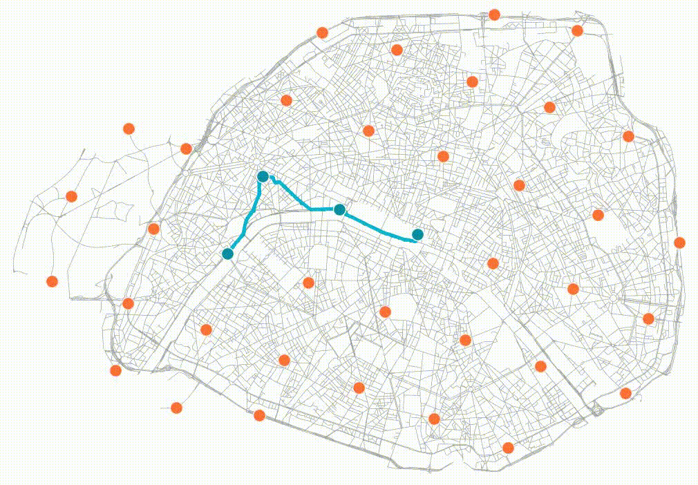

# Growing Urban Bicycle Networks

This is the source code for the scientific paper [*Growing urban bicycle networks*](https://www.nature.com/articles/s41598-022-10783-y) by [M. Szell](http://michael.szell.net/), S. Mimar, T. Perlman, [G. Ghoshal](http://gghoshal.pas.rochester.edu/), and [R. Sinatra](http://www.robertasinatra.com/). The code downloads and pre-processes data from OpenStreetMap, prepares points of interest, runs simulations, measures and saves the results, creates videos and plots. 

**Paper**: [https://www.nature.com/articles/s41598-022-10783-y](https://www.nature.com/articles/s41598-022-10783-y)  
**Data repository**: [zenodo.5083049](https://zenodo.org/record/5083049)  
**Visualization**: [GrowBike.Net](https://growbike.net)  
**Videos & Plots**: [https://growbike.net/download](https://growbike.net/download)

[](https://growbike.net/city/paris)
*Video output from running the code on Paris, showing the growth of a bicycle network on a grid of seed points*

## Instructions

### 1. Git clone the project _without_ the full history 

Run from your terminal:

```
git clone -b main --single-branch https://github.com/mszell/bikenwgrowth --depth 1
```

### 2. Install the conda environment `growbikenet`

In your terminal, navigate to the project folder `bikenwgrowth` and use [`conda`](https://docs.conda.io/projects/conda/en/latest/index.html)
or [`mamba`](https://mamba.readthedocs.io/en/latest/installation/mamba-installation.html)
or [`micromamba`](https://mamba.readthedocs.io/en/latest/installation/micromamba-installation.html) to run:

```
mamba env create -f environment.yml
mamba activate growbikenet
```

#### Environment creation from command line

If the above doesn't work, you can manually create the environment from your command line (not recommended):

```
mamba create --override-channels -c conda-forge -n growbikenet python=3.12 osmnx=1.9.4 python-igraph watermark haversine rasterio tqdm geojson
mamba activate growbikenet
mamba install -c conda-forge ipywidgets
pip install opencv-python
pip install --user ipykernel
```

#### Set up Jupyter kernel

If you want to use the environment `growbikenet` in Jupyter, run:

```bash
python -m ipykernel install --user --name=growbikenet
```

This allows you to run Jupyter with the kernel `growbikenet` (Kernel > Change Kernel > growbikenet)


### 3a. Run the code locally

Single (or few/small) cities can be run locally by a manual, step-by-step execution of Jupyter notebooks:

1. Populate [`parameters/cities.csv`](parameters/cities.csv), see below. Leave default values to run the code on two small cities.
2. Navigate to the [`code`](code/) folder.
3. Run notebooks 01 and 02 once to download and prepare all networks and POIs.  
4. Run notebooks 03, 04, 05 for each parameter set (see below), set in [`parameters/parameters.py`](parameters/parameters.py)
5. Optional: Run 06 to create videos.
6. Optional: Further notebooks named with `X_` can be run if needed to generate extra results or data.

### 3b. Run the code on an HPC cluster with SLURM

For multiple, esp. large, cities, running the code on a high performance computing cluster is strongly suggested as the tasks are easy to paralellize. The shell scripts are written for [SLURM](https://slurm.schedmd.com/overview.html).  

1. Populate [`parameters/cities.csv`](parameters/cities.csv), see below.
2. Run 01 and 02 once locally to download and prepare all networks and POIs (The alternative is server-side `sbatch scripts/download.job`, but OSMNX throws too many connection issues, so manual supervision is needed)
3. Upload `code/*.py`, `parameters/*`, `scripts/*`
4. Run: `./mastersbatch_analysis.sh`
5. Run, if needed: `./mastersbatch_export.sh`
6. After all is finished, run: `./cleanup.sh`
7. Recommended, run: `./fixresults.sh` (to clean up results in case of amended data from repeated runs)

## Folder structure and output
The main folder/repo is `bikenwgrowth`, containing Jupyter notebooks (`code/`), preprocessed data (`data/`), parameters (`parameters/`), result plots (`plots/`), HPC server scripts and jobs (`scripts/`).

Most of the generated data output (network plots, videos, results, exports, logs) makes up many GBs and is stored in the separate external folder `bikenwgrowth_external`. To set up different paths, edit [`code/path.py`](code/path.py)

## Parameter sets 
1. `prune_measure = "betweenness"`, `poi_source =  "railwaystation"`  
2. `prune_measure = "betweenness"`, `poi_source =  "grid"`  
3. `prune_measure = "closeness"`, `poi_source =  "railwaystation"`  
4. `prune_measure = "closeness"`, `poi_source =  "grid"`  
5. `prune_measure = "random"`, `poi_source =  "railwaystation"`  
6. `prune_measure = "random"`, `poi_source =  "grid"` 

## Populating cities.csv

### Checking nominatimstring  
* Go to e.g. [https://nominatim.openstreetmap.org/ui/search.html?q=paris%2C+france](https://nominatim.openstreetmap.org/ui/search.html?q=paris%2C+france) and enter the search string. If a correct polygon (or multipolygon) pops up it should be fine. If not leave the field empty and acquire a shape file, see below.

### Acquiring shape file  
* Go to [Overpass](https://overpass-turbo.eu/), to the city, and run:
    `relation["boundary"="administrative"]["name:en"="Copenhagen Municipality"]({{bbox}});(._;>;);out skel;`
* Export: Download as GPX
* Use QGIS to create a polygon, with Vector > Join Multiple Lines, and Processing Toolbox > Polygonize (see [Stackexchange answer 1](https://gis.stackexchange.com/questions/98320/connecting-two-line-ends-in-qgis-without-resorting-to-other-software) and [Stackexchange answer 2](https://gis.stackexchange.com/questions/207463/convert-a-line-to-polygon))
